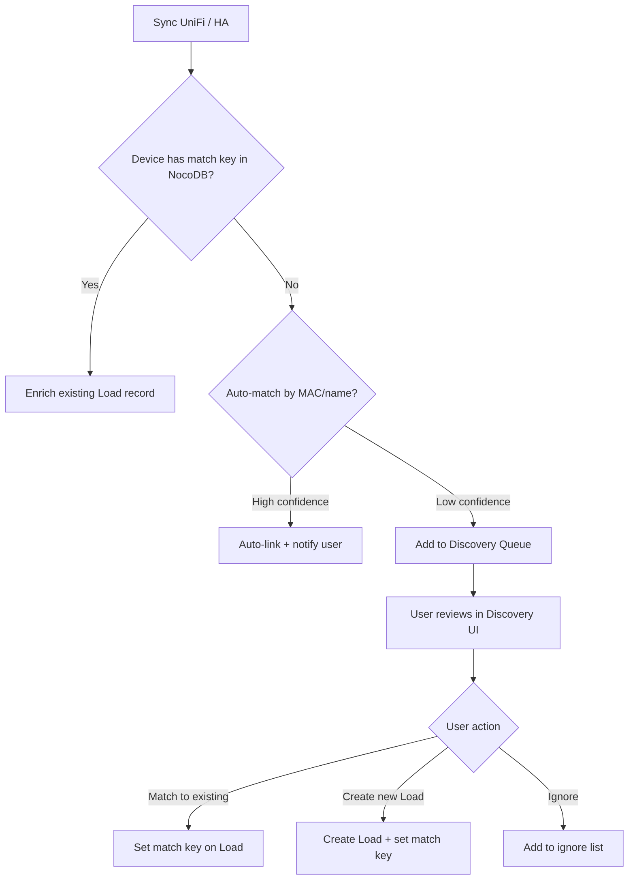

# Device Unification Layer — Design Document

## Problem Statement

The PWA currently manages "Loads" in NocoDB as the primary record of powered devices in the home. However, three external systems also maintain overlapping device inventories:

1. **UniFi Network** — Every networked device (cameras, APs, switches, IoT hubs, smart TVs, etc.)
2. **Home Assistant** — Every smart device (Z-Wave switches, Zigbee sensors, integrations like Emporia Vue, Ecobee, etc.)
3. **Homebox** (future) — Physical inventory of owned items with purchase info, warranty, photos

Each system has partial truth about a device. A Raspberry Pi might be:
- A **UniFi client** (MAC, IP, switch port, hostname)
- A **HA device** (area assignment, entities for monitoring)
- A **Homebox item** (purchase date, serial number, photo)
- A **NocoDB Load** (circuit assignment, breaker, room placement)

**Goal:** Merge these views at runtime into a unified "Device Card" without duplicating data we'd then need to sync.

---

## Design Principles

### 1. NocoDB as Source of Truth for Electrical
NocoDB owns the **electrical topology** — which circuit a device is on, its breaker rating, room placement on the floorplan, wire runs. This never changes based on external systems.

### 2. External Systems as Runtime Enrichment
UniFi, HA, and Homebox provide **live metadata** that enriches the device view but is never copied into NocoDB. We store only the **match keys** (MAC address, HA device_id, Homebox item_id) in NocoDB.

### 3. Merge at Read Time
When displaying a device, the server merges NocoDB record + cached external data using match keys. If an external system is unavailable, we gracefully show only what we have.

### 4. Minimal Schema Extension
Add only match-key fields to NocoDB. Rich metadata (manufacturer, model, IP, firmware) comes from the external system at runtime.

---

## Data Sources & Fields

### UniFi (via REST API)
| Field | Use |
|-------|-----|
| `mac` | **Primary match key** |
| `name` / `hostname` | Display name suggestion |
| `ip` | Shown in device card |
| `oui` (MAC manufacturer) | Manufacturer inference |
| `sw_mac` + `sw_port` | Network topology / upstream |
| `is_wired` | POE candidate detection |
| `network` | VLAN/network segment |
| `uptime` / `last_seen` | Online status |

### Home Assistant (via WebSocket API)
| Field | Use |
|-------|-----|
| `id` (device_id) | **Match key** |
| `name` / `name_by_user` | Display name |
| `manufacturer` | Device card detail |
| `model` | Device card detail |
| `sw_version` | Firmware info |
| `area_id` | Room inference / suggestion |
| `connections` (MAC) | **Cross-match to UniFi** |
| `via_device_id` | Hub/parent device |
| `identifiers` | Integration-specific IDs |
| `config_entries` | Which integration owns it |

### Homebox (via REST API — future)
| Field | Use |
|-------|-----|
| `id` | **Match key** |
| `name` | Display name |
| `manufacturer` | Enrichment |
| `model` | Enrichment |
| `serialNumber` | Asset tracking |
| `location` | Room cross-reference |
| `labels` | Categorization |
| `purchaseDate` | Warranty tracking |
| `warrantyExpiry` | Alert if expiring |
| `value` | Insurance/replacement cost |
| `photoUrl` | Device card image |
| `notes` | User notes |

### NocoDB Loads (existing + proposed additions)
| Field | Status | Purpose |
|-------|--------|---------|
| `Title` | Existing | Display name |
| `Device Type` | Existing | Category (Networking, Appliance, etc.) |
| `Network_Match_Key` | Existing | MAC address for UniFi match |
| `Network_Role` | Existing | Router/Switch/AP/Endpoint |
| `Network_Upstream` | Existing | Upstream device link |
| `Power_Source` | Existing | AC/POE/POE+ |
| `Area_id` | Existing | Room assignment (floorplan) |
| `Circuit` | Existing | Circuit link |
| **`HA_Device_Id`** | **NEW** | Home Assistant device registry ID |
| **`Homebox_Item_Id`** | **NEW** | Homebox item UUID |
| **`Device_Category`** | **NEW** | Refined category (see below) |

---

## Device Categories (Proposed Taxonomy)

Current `Device Type` is too coarse ("Networking", "Appliance"). Propose a richer taxonomy:

| Category | Icon | Color | Examples |
|----------|------|-------|----------|
| `networking` | `mdi:router-wireless` | Fuchsia | Routers, switches, APs, mesh nodes |
| `camera` | `mdi:cctv` | Red | Security cameras, doorbells |
| `media` | `mdi:television` | Purple | TVs, speakers, streaming sticks |
| `computing` | `mdi:desktop-tower` | Slate | PCs, servers, NAS, Raspberry Pi |
| `iot-hub` | `mdi:hub` | Teal | YoLink, SmartThings, Zigbee coordinators |
| `climate` | `mdi:thermostat` | Green | Thermostats, HVAC, fans |
| `lighting` | `mdi:lightbulb` | Yellow | Smart bulbs, LED controllers |
| `sensor` | `mdi:motion-sensor` | Cyan | Motion, door/window, leak sensors |
| `appliance` | `mdi:washing-machine` | Orange | Washer, dryer, fridge, dishwasher |
| `power` | `mdi:flash` | Amber | UPS, PDU, smart plugs, Emporia Vue |
| `security` | `mdi:shield-home` | Red | Alarm panels, locks, sirens |
| `other` | `mdi:devices` | Slate | Catch-all |

---

## Architecture

```
┌──────────────────────────────────────────────────────────────────┐
│                        Browser (PWA)                               │
│                                                                    │
│  Device Card ◄── Merged view (NocoDB + enrichments)               │
│  Discovery   ◄── Unmatched items from UniFi/HA                    │
│  Settings    ◄── Integration config + mapping UI                  │
└───────────────────────────┬──────────────────────────────────────┘
                            │
                            ▼
┌──────────────────────────────────────────────────────────────────┐
│                   SvelteKit Server (Merge Layer)                    │
│                                                                    │
│  /api/devices/unified    ── Merged device list                    │
│  /api/devices/unmatched  ── Discovery queue                       │
│  /api/devices/match      ── Create/confirm match                  │
│  /api/devices/[id]/card  ── Single merged device card             │
│                                                                    │
│  DeviceMergeService:                                              │
│    1. Load NocoDB records (with match keys)                       │
│    2. Fetch cached external data (UniFi + HA + Homebox)           │
│    3. Join on match keys → unified device objects                 │
│    4. Return unmatched externals as "discovery" queue             │
└────────┬──────────────┬────────────────┬─────────────────────────┘
         │              │                │
         ▼              ▼                ▼
    ┌─────────┐   ┌──────────┐    ┌──────────┐
    │ NocoDB  │   │  UniFi   │    │   HA     │    ┌──────────┐
    │ (Loads) │   │Controller│    │ Instance │    │ Homebox  │
    └─────────┘   └──────────┘    └──────────┘    └──────────┘
```

### Caching Strategy

External system data is cached server-side with TTL:

| Source | Cache TTL | Refresh Trigger |
|--------|-----------|-----------------|
| UniFi devices/clients | 60s | Background poll or manual sync |
| HA device registry | 120s | WebSocket subscription or poll |
| Homebox items | 300s | Manual sync (rarely changes) |

If cache is stale AND source is unreachable → serve stale with "last updated X ago" indicator.

---

## Matching Strategy

### Automatic Matching (high confidence)

| Method | Confidence | Example |
|--------|-----------|---------|
| MAC exact match (UniFi ↔ NocoDB) | 100% | `Network_Match_Key` matches `client.mac` |
| MAC exact match (HA ↔ UniFi) | 100% | HA `connections: [["mac", "..."]]` matches UniFi `mac` |
| HA device_id match (HA ↔ NocoDB) | 100% | `HA_Device_Id` field set |
| Homebox item_id match | 100% | `Homebox_Item_Id` field set |

### Suggested Matching (needs confirmation)

| Method | Confidence | UI |
|--------|-----------|-----|
| Name fuzzy match (Levenshtein ≤ 2) | 70% | "Did you mean...?" |
| Same manufacturer + similar name | 60% | Suggestion card |
| IP match (unstable) | 40% | Lower priority suggestion |
| HA area ↔ NocoDB room match + similar name | 50% | Grouped suggestion |

### Cross-System Linkage

A single physical device may appear in multiple systems. The merge layer resolves:

```
Physical: "Raspberry Pi 4 (Office)"
  ├── UniFi client: mac=aa:bb:cc:dd:ee:ff, ip=192.0.2.50
  ├── HA device: id=abc123, via UniFi integration, area=office
  └── NocoDB Load: id=42, Network_Match_Key=aa:bb:cc:dd:ee:ff, Circuit=C-12

→ Unified Device Card shows ALL enrichments from all 3 sources
```

---

## Discovery Flow (New Device Detection)



---

## Graceful Degradation

| Scenario | Behavior |
|----------|----------|
| UniFi not configured | No network enrichment shown; Load cards show only NocoDB data |
| UniFi configured but unreachable | Show stale cache with "offline" badge; no discovery |
| HA not configured | No HA enrichment; device control buttons hidden |
| HA configured but unreachable | Show stale cache; control buttons disabled with tooltip |
| Homebox not configured | No inventory enrichment |
| All integrations down | App works normally with NocoDB data only (baseline) |
| NocoDB down | **App broken** — this is the core (existing failure mode) |

---

## Settings Redesign

The settings page is getting overloaded. Propose reorganizing into **tabbed sections**:

### Proposed Settings Structure

```
Settings
├── 🔌 Integrations (tab)
│   ├── UniFi Network        [Connected ✓] [Configure]
│   ├── Home Assistant       [Connected ✓] [Configure]
│   ├── Homebox Inventory    [Not configured] [Setup]
│   └── AI / Chat            [Connected ✓] [Configure]
│
├── 🔗 Device Mapping (tab)
│   ├── Auto-match rules (on/off, confidence threshold)
│   ├── Discovery queue (N new devices found)
│   ├── Ignored devices list
│   └── Manual match tool
│
├── 🏷️ Labels & Printing (tab)
│   ├── Tape size / DPI
│   ├── BLE config
│   └── Format preferences
│
├── ☀️ Energy & Solar (tab)
│   ├── Solar entity selectors
│   ├── Utility rate
│   └── Grid import/export entities
│
└── ⚙️ General (tab)
    ├── Home name / location
    ├── Theme preference
    └── Data export / backup
```

Each integration card shows:
- Connection status (green dot / red dot / gray "not configured")
- Last sync timestamp
- Quick actions (Test / Sync / Configure)
- Inline expandable config form

---

## New API Endpoints

### `GET /api/devices/unified`
Returns merged device list for the main device browser.

```typescript
interface UnifiedDevice {
  // Core (from NocoDB)
  id: string;                    // NocoDB record ID
  name: string;                  // Display name
  deviceCategory: string;        // From taxonomy above
  circuitId?: string;            // Linked circuit
  areaId?: string;               // Room assignment
  powerSource?: string;          // AC/POE/POE+
  
  // Enrichment (from externals, nullable)
  network?: {                    // From UniFi
    mac: string;
    ip: string;
    hostname: string;
    isOnline: boolean;
    lastSeen: string;
    switchPort?: { switchName: string; port: number };
    poePower?: number;           // watts
    manufacturer?: string;       // from OUI
    vlan?: string;
  };
  
  homeAssistant?: {              // From HA device registry
    deviceId: string;
    manufacturer: string;
    model: string;
    swVersion?: string;
    areaName?: string;           // HA area (may differ from NocoDB room)
    entities: string[];          // entity_ids for this device
    isControllable: boolean;     // has switch/light entities
  };
  
  inventory?: {                  // From Homebox
    itemId: string;
    serialNumber?: string;
    purchaseDate?: string;
    warrantyExpiry?: string;
    value?: number;
    photoUrl?: string;
    notes?: string;
  };
  
  // Computed
  sources: ('nocodb' | 'unifi' | 'ha' | 'homebox')[];
  matchConfidence?: number;      // For suggested matches
}
```

### `GET /api/devices/discovery`
Returns unmatched devices from external systems.

```typescript
interface DiscoveryItem {
  source: 'unifi' | 'ha' | 'homebox';
  externalId: string;            // MAC, device_id, or item_id
  name: string;
  metadata: Record<string, any>; // Source-specific fields
  suggestions: Array<{           // Possible NocoDB matches
    loadId: string;
    loadName: string;
    confidence: number;
    reason: string;              // "MAC prefix match", "Similar name", etc.
  }>;
}
```

### `POST /api/devices/match`
Confirm or create a match.

```typescript
// Match to existing load
{ action: 'link', externalId: string, source: string, loadId: string }

// Create new load from discovery
{ action: 'create', externalId: string, source: string, name: string, deviceCategory: string, areaId?: string }

// Ignore this device
{ action: 'ignore', externalId: string, source: string }
```

---

## HA Device Registry Integration (New)

We need to add WebSocket support for the HA device registry. This is a new capability:

```typescript
// New: ha-devices.ts
export async function getHADevices(): Promise<HADevice[]> {
  // Connect via WebSocket
  // Send: { id: 1, type: "config/device_registry/list" }
  // Returns full device list with manufacturer, model, area, connections
}

export async function getHAAreas(): Promise<HAArea[]> {
  // Send: { id: 2, type: "config/area_registry/list" }  
  // Returns areas with id, name, picture
}
```

This replaces the current template-based area fetching with proper registry access.

---

## Implementation Phases

### Phase 1: HA Device Registry + Cross-Match Keys
- Add WebSocket `config/device_registry/list` call
- Add `HA_Device_Id` field to NocoDB Loads table
- Auto-match HA devices to UniFi clients via MAC in `connections`
- Show enriched device cards with HA metadata

### Phase 2: Discovery Queue UI
- New `/devices/discovery` page (or panel in existing search)
- Show unmatched UniFi clients + HA devices
- Suggestion cards with confidence scores
- One-click "Create Load" or "Link to existing"
- Bulk actions (ignore all networking gear, etc.)

### Phase 3: Unified Device Browser
- Replace or augment search page with unified device view
- Filterable by source, category, room, online status
- Device card shows merged info from all sources
- Quick actions (control via HA, view on floorplan, print label)

### Phase 4: Homebox Integration
- Add Homebox config to settings
- `Homebox_Item_Id` field in NocoDB
- Photo display in device cards
- Warranty expiry alerts on homepage insights

### Phase 5: Settings Redesign
- Tabbed settings layout
- Integration cards with status indicators
- Device Mapping tab with discovery queue inline

---

## UI/UX Decisions (Confirmed)

### Navigation Changes
- **Settings moves to top-right gear icon** (frees bottom nav slot)
- **Bottom nav (6 items):** Home · Rooms · Panels · **Devices** · Energy · Ask AI
- Devices page is the new unified device browser (Mockup 5)
- Future consideration: move Energy off bottom nav (reachable from homepage banner)

### Unified Device Card (Mockup 1) — Interaction Pattern
The expanded device card is a **reusable bottom-sheet component** that slides up from any entry point:

| Entry Point | Trigger | Result |
|---|---|---|
| Rooms → List view | Tap any device row | Slide-up bottom sheet |
| Rooms → Plan view → area popover | Tap a device name | Slide-up bottom sheet |
| Devices page (unified list) | Tap a device row | Slide-up bottom sheet |
| Search results | Tap a load/device result | Slide-up bottom sheet |
| Homepage insight | Tap referenced device | Navigate + open sheet |

**Bottom sheet behavior:**
- Drag handle at top for swipe-to-dismiss
- Default: half-height (shows Electrical + one enrichment section)
- Drag up: expand to full-height (all sections visible)
- Swipe down: dismiss back to previous view
- Section order: **Electrical first** (primary), then Network, then HA (secondary enrichments)

### Discovery Queue Surfaces (Mockup 2)
- **Devices page (primary):** shown as a filter tab or top banner ("5 new devices found")
- **Settings → Device Mapping tab:** inline summary + "View full queue" link
- **Homepage insight card:** "5 new devices found" → deep link to Devices page filtered to discovery

### Match Suggestions
- Show the matched Load's **room name** alongside the load name for disambiguation
- Format: `95% match: "Basement WiFi AP" · Basement`

### Integration Branding
- Use **actual provider logos** (not generic MDI icons) for UniFi, Home Assistant, Homebox
- CDN source: `https://cdn.jsdelivr.net/gh/homarr-labs/dashboard-icons/svg/{name}.svg`
  - `unifi.svg` — UniFi (brand blue #0559C9)
  - `home-assistant.svg` — Home Assistant (brand cyan #18BCF2)
  - `homebox.svg` — Homebox
- Used in: settings integration cards, source badges, enrichment section headers, discovery queue badges
- Fallback: MDI icons if CDN unreachable (PWA offline mode)

---

## Open Questions for Discussion

1. **Should we auto-create Loads from UniFi clients?** Or always require user confirmation? (Recommendation: require confirmation but make it one-click)

2. **How to handle HA devices that span multiple integrations?** (e.g., a Hue bulb is both a Zigbee device and a Hue device in HA). Answer: Use HA's canonical `device_id` as the single match key.

3. **Should the unified view replace the Search page or be a new page?** (Recommendation: enhance Search with a "Devices" tab that shows the merged view)

4. **Homebox self-hosted URL — do users need LAN access?** Same pattern as UniFi/HA — configure URL + API key in settings.

5. **How often should we sync?** (Recommendation: UniFi 60s background poll, HA via WebSocket subscription for real-time, Homebox on-demand only)

6. **Device Category vs Device Type** — should we migrate existing `Device Type` field or add `Device_Category` alongside? (Recommendation: add alongside, deprecate old field gradually)
